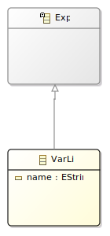

# Introduction

This page introduces the software language semantics extension capabilities of Alex by following the development of a small expression language with variables, by extension of the TEL0 language developed in [getting started](./getting-started.md).

# TEL1

Tiny Expression Language 1 (TEL1) is an extension of TEL0 with a major improvement, the introduction of variable literals.

In summary, TEL1 is composed of the following concepts:

- Integer Literal (e.g. 0, 1...);
- Sum operation (e.g. +);
- Variable Literal (e.g. x, y).

We are going to develop TEL1 by modular extension of TEL0, in other word we are going to develop TEL1 without editing the artifacts of TEL0 or recompiling it.

# Abstract Syntax

Modularily extending the abstract syntax is done by cross referencing the reused ecore metamodel from a new one, using either references or inheritance.

In our case, we will only use inheritance to crate a new `tel1.VarLit` class, inheriting `tel0.Exp`.

The following picture presents the abstract syntax of TEL1.

`LitVal` and `Sum` are not depicted but are still part of the `tel0` metamodel.

# Semantics

Following the same principle, we are going to introduce a new semantics for TEL0 by reusing the existing ...

# Conclusion

# Next

Composition
