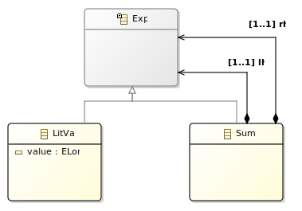

# Introduction

This page introduces the main concepts of Alex by following the development of a small expression language.

For more details about the language see TODO.

# TEL0

Tiny Expression Language 0 (TEL0) is a toy expression language with two concepts:

- Integer Literal (e.g. 0, 1...)
- Sum operation (e.g. +)

# Abstract Syntax

We define the abstract syntax using ecore.
This [tutorial](https://eclipsesource.com/blogs/tutorials/emf-tutorial/) explains in details how to use ecore to define a metamodel.

In order to understand the rest of this introduction, you only need to understand that ecore is a formalism to define metamodels and allows the generation of Java code that conforms to this definition.

From the definition of TEL0, we define the following ecore model:


We introduce the `Exp` abstract class in order to allow the recursive definition of sums (e.g.  1 + 2 + 3 + 4).

From this metamodel definition we generate, using EMF, a set of java classes.


You can find the implementation of TEL0 abstract syntax in [github](https://github.com/diverse-project/alex/tree/master/examples/tel0.model).

# Revisitor

In addition to the set of java class, Alex offers the generation of a abstract, visitor-like, interface called a *Revisitor*.

To understand this tutorial, and to use Alex, it is not required to understand the Revisitor mechanism.
Just know that it's generation is required in order to be able to define a semantics on top of the abstract syntax.

The interested reader can consult the [revisitor](./revisitor.md) page to understand the internal details.

# Semantics

Once we have defined the abstract syntax of our language, we want to give it some meaning.

The good news is, using Alex it is easy to define multiple meanings to a single abstract syntax in a modular way.

We will show how to add a pretty printer and an evaluation semantics for TEL0, in a modular way.

## Pretty Printing

The pretty printer is a simple way to transform the object graph of an instance of the abstract syntax to a user readable string.

For instance `Add (LitVal(1), Add(LitVal(2), LitVal(3)))` will be pretty printed to `"1 + 2 + 3"`.

The following Alex program is the definition of the pretty print semantics for TEL0.

```alex
behavior prettyprint

import ecore "platform:/resource/tel0.model/model/tel0.ecore"

open abstract class Exp {
	abstract def String print()
}

open class LitVal {
	override String print() {
		obj.value.toString
	}
}

open class Sum {
	override String print() {
		alg.$(obj.lhs).print() + ' + ' + alg.$(obj.rhs).print()
	}
}
```

This definition requires a few explanations.

**Line 1:** Definition of the name of the semantics.
Pretty much similar to a package definition.

**Line 3:** Import of the abstract syntax.
It defines the set of class on which we are able to define operations.

**Lines 5-7:** Definition of the print operation on the Exp abstract class.
As with every object-oriented language, it enforce that each child of `Exp` must provide a concrete implementation of the print method.

**Lines 9-13:** Definition of the print operation for the LitVal class.  
We want use the toString operation to convert the long value to a string.  
But we are defining the pretty print semantics externally, consequently we don't have a direct access to the value field of the syntax.  
To have access to the syntactic values from the semantics, we must use the `obj` field provided by Alex for every open class, before being able to convert it to a string.

**Lines 15-19:** Definition of the print operation for the Sum class.
To pretty print a sum, we need to obtains the result of the print method for the left hand side (lhs) and right hand side (rhs) fields of the Sum class.

But what we have currently is the `obj` field which gives use access to the syntactic part of the Sum class, which contains the lhs and rhs Exp expressions.

Consequently, we don't have access to the print operation on the field so far.

To do so, we fist needs to converts the syntactic value to semantics operations, using the `alg` field, also provided by Alex for each open class.
This alg fields contains an instance of the currently defined semantics, in the form of a revisitor.

The revisitor provides a methods called `$` which take a syntactic object (e.g. Exp, Sum, LitVal) and returns a semantic operation, with all the operations defined in the Alex semantics.

For instance alg.$(obj.lhs) returns an semantic operation with a print method.

The good thing is, since obj.lhs is an abstract Exp object, we don't know statically if the returned semantic object will be for a Sum or a LitVal object, still we know that the returned value will be a string that we will be able to concatenate before returning the resulting string.

**Summary**

So far we have defined a first semantics for TEL0, which allow to pretty print arbitrary instances of TEL0 abstract syntax.

A working implementation of TEL0 pretty printing is available in [github](https://github.com/diverse-project/alex/tree/master/examples/tel0.prettyprint)

## Evaluation

Most of the useful concept of Alex are already covered by the definition of the pretty printing semantics.

To highlight the ability of define new semantics modularily (i.e. without having to impact previously defined source code) for a single abstract syntax, we will show how to implement a evaluation semantics for TEL0.

We simply have to create a new alex file, give it a new behavior name, and import the same ecore metamodel.

Of course the signature of the open class methods and will be different.

```alex
behavior evaluate

import ecore "platform:/resource/tel0.model/model/tel0.ecore"

open abstract class Exp {
	abstract def long eval()
}

open class LitVal {
	override long eval() {
		obj.value
	}
}

open class Sum {
	override long eval() {
		alg.$(obj.lhs).eval() + alg.$(obj.rhs).eval()
	}
}
```

We can observe that the structure is quite close to the pretty printer, the main different is the return type of eval, a long instead of a String.

Consequently, if we execute the same `Add (LitVal(1), Add(LitVal(2), LitVal(3)))` program we obtains `6` instead of  `"1 + 2 + 3"`.

A working implementation of TEL0 pretty printing is available in [github](https://github.com/diverse-project/alex/tree/master/examples/tel0.evaluate).

## Execution

So far we have defined two semantics for TEL0. But the interesting part is to be able to use our language to execute programs.

The `tel0.tests` project, available on [github](https://github.com/diverse-project/alex/tree/master/examples/tel0.tests), contains a single test class `tel0.tests.Tel0Test` which showcase how to use our language.

The source Below is a commented version of the `Tel0Test` class.

```java
package tel0.tests;

// JUnit 5 imports.
import org.junit.jupiter.api.Assertions;
import org.junit.jupiter.api.Test;

// imports of the two semantics, in the form of the revisitor
// generated from the *.ale semantics definition.
import evaluate.revisitor.impl.EvaluateRevisitor;
import prettyprint.revisitor.impl.PrettyprintRevisitor;

// import of the abstract syntax concepts.
import tel0.model.tel0.Exp;
import tel0.model.tel0.LitVal;
import tel0.model.tel0.Sum;
// and the EMF factory used to instantiate the concepts.
import tel0.model.tel0.Tel0Factory;

public class Tel0Test {

	/**
	 * Instantiation of the revisitors. The imported revisitors are
	 * Java 8 interfaces with default methods. We define anonymous
	 * classes from the interfaces in order to be able to
	 * instantiate them (cf. https://docs.oracle.com/javase/tutorial/java/javaOO/anonymousclasses.html).
	 */
	private final EvaluateRevisitor revExec
		= new EvaluateRevisitor() {};
	private final PrettyprintRevisitor revPrint
		= new PrettyprintRevisitor() {};

	/**
	 * Creation of a simple TEL0 program by metamodel manipulation.
	 *
	 * @return 1 + 2
	 */
	private Exp createModel0() {

		// Creation of a sum operation.
		final Sum exp = Tel0Factory.eINSTANCE.createSum();
		// Creation a literal value with the value 1.
		final LitVal x = Tel0Factory.eINSTANCE.createLitVal();
		x.setValue(1L);
		// Affectation of the value 1 to the left-hand side of
		// the sum.
		exp.setLhs(x);

		// Creation and affectation of the value 2 to the right
		// hand side of the sum.
		final LitVal y = Tel0Factory.eINSTANCE.createLitVal();
		y.setValue(2L);
		exp.setRhs(y);

		return exp;
	}

	/**
	 * Execution test.
	 */
	@Test
	void test0Exec() {
		final Exp exp = createModel0();
		Assertions.assertEquals(3L, revExec.$(exp).eval());
	}

	/**
	 * Pretty print test.
	 */
	@Test
	void test0Print() {
		final Exp exp = createModel0();
		Assertions.assertEquals("1 + 2", revPrint.$(exp).print());
	}
}

```


# Conclusion

So far we have implemented an abstract syntax and two semantics for the TEL0 toy language.

It can look deceiving, but doing so we learned most of the main concepts required to build larger languages.

# Next

## Using Alex

The main point of Alex not covered by this introduction is the language [extension](./extension.md) and [composition](./composition.md) mechanisms.

In addition, the code generation mechanisms underlying Alex are covered in the [Revisitor](./revisitor.md) page.

## EMF Ecosystem

Once a language have been defined using EMF, our language can be improved in several ways:

- A textual grammar with [Xtext](https://www.eclipse.org/Xtext/).
- A graphical representation with [Sirius](https://www.obeo.fr/fr/produits/eclipse-sirius).
